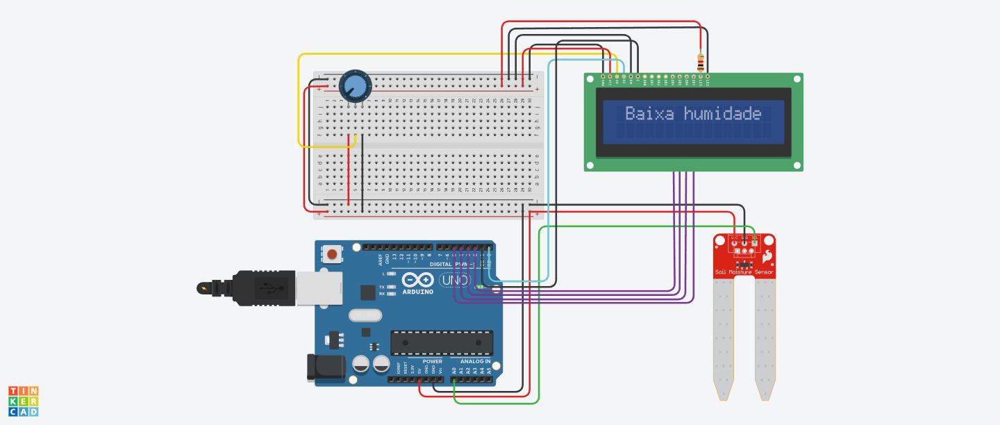

# Sensor de Umidade com Display LCD

## Descrição

Este é um código desenvolvido para um projeto utilizando um sensor de umidade e um display LCD. O código foi criado no Tinkercad e tem como objetivo monitorar a umidade do ambiente e exibir mensagens adequadas no display LCD com base nos valores lidos pelo sensor.

## Funcionamento

O código utiliza um sensor de umidade conectado à porta analógica A0 do Arduino. O valor lido pelo sensor é mapeado para um intervalo de 0 a 180 e, em seguida, é exibido no display LCD. Se a umidade medida for igual ou inferior a 45, uma mensagem indicando "Baixa umidade" é exibida no display. Caso contrário, uma mensagem indicando "Umidade adequada" é exibida.

## Componentes Utilizados

- Arduino Uno
- Sensor de Umidade
- Display LCD 16x2

## Autor

- Nome: Adryan Ryan
- Instagram: [@adryanrr](https://instagram.com/adryanrr)

## Licença

Este projeto é distribuído sob a [Licença MIT](https://opensource.org/licenses/MIT).